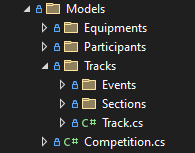
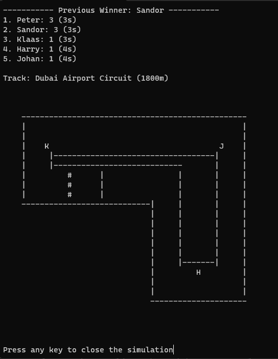
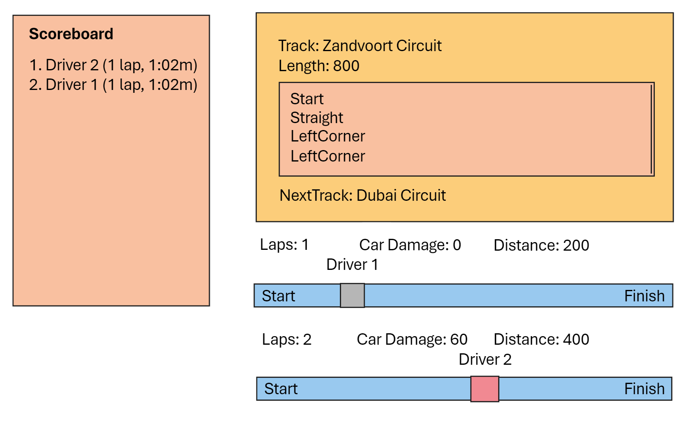
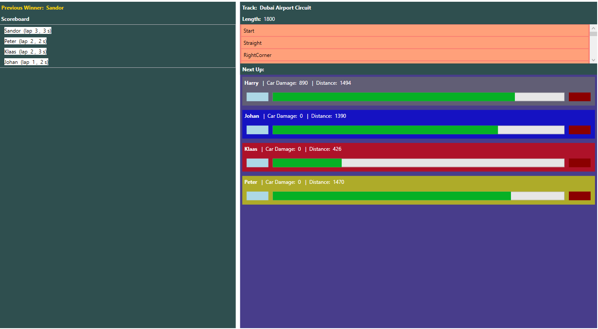
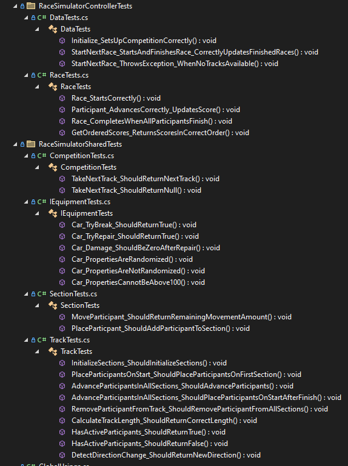

# Improved Race Simulator (V2)
The initial version of our project didn't fully align with clean-code and SOLID principles, prompting this comprehensive remake. This iteration is developed using C# .NET 8.0 and showcases significant improvements.

## Features

### Core Project (RaceSimulatorShared)
The **RaceSimulatorShared** project forms the backbone of the Race Simulator application, defining key models and components integral to the simulation. This core library is organized into various directories, each tailored to specific simulation aspects:
#### Models
The **Models** directory contains the core models for the application, which means they are used in multiple projects and important for the application's functionality. These models include:
  - **Competition.cs**: Structures and properties of a competition, including multiple races or tracks.
  - **Equipments/**:
      - **Car.cs**: Representation of a car with unique attributes and capabilities.
      - **IEquipment.cs**: Interface outlining standard functionalities for participants' equipment.

  - **Participants/**:
      - **Driver.cs**: Individual driver characteristics and associated equipment.
      - **IParticipant.cs**: Blueprint interface for a race participant.
      - **TeamColors.cs**: Enumerates team colors associated with participants.

  - **Tracks/**:
      - **Track.cs**: Details of a race track including name and sections.
      - **Events/**:
        - **ParticipantChangedEventArgs.cs**: Events for participant status or position changes.
        - **ParticipantLappedEventArgs.cs**: Events marking a participant's lap completion.
        - **TrackAdvancedEventArgs.cs**: Signals race track progress.
        - **TrackEventsManager.cs**: Manages track-related events.

      - **Sections/**:
        - **Direction.cs**: Enumerates possible directions in a track section.
        - **Section.cs**: Represents a single section of the race track, detailing type and direction.
        - **SectionType.cs**: Defines different types of track sections, such as start, finish, and corner.

##### Image of folder structure

### Controller Project (RaceSimulatorController)
The **RaceSimulatorController** project serves as the control center for managing the race logic and data flow. It consists of several key components:
  - **Data.cs**: Centralizes the data management for the application, handling race creation, progression, and storage.
  - **Events/**:
      - **RaceChangedEventArgs.cs**: Defines an event that occurs when there's a significant change in the current race.
      - **RaceFinishedEventArgs.cs**: Represents the event data when a race is completed.

  - **Exceptions/**:
      - **NoTracksException.cs**: Thrown when no tracks are available for racing.
      - **RaceNotFoundException.cs**: Indicates that a requested race could not be found.
  
  - **Race.cs**: Represents a single race, encompassing the logic for starting the race, handling participant laps, and determining the race's conclusion.
  - **Score.cs**: Defines the scoring system, keeping track of each participant's laps and time elapsed.

### Console Project (RaceSimulatorConsole)
The following images displays the console application in action:
  - The top of the console is a **scoreboard**. You can see the placement, name, laps and time of each participant (in that order).
  - The middle of the console is the track. The track is divided into sections. You can always recognize the start and finish by the lines on the road, **"#"** is the **finishline** and **"|"** is the **startline**.
  - You can recognize the **participants** by the first letter of their name.
  - The **start** of the track is always facing right.

The **RaceSimulatorConsole** project provides a text-based interface for interacting with the Race Simulator. It includes:
  - **Program.cs**: The main entry point for the console application, orchestrating user interaction, race initialization, and progression.
  - **Tools/**:
      - **TrackPrinter.cs**: A utility class for printing the race track and participant positions to the console, visualizing race progress in a text-based format.
      - **TrackVisualizer.cs**: Enhances the visualization of the race track within the console, providing a more detailed view.
    
### WPF Project (RaceSimulatorWPF)
The **RaceSimulatorWPF** project introduces a Graphical User Interface using Windows Presentation Foundation (WPF). It includes:
  - **App.xaml.cs**: Initializes the WPF application and sets up the main environment.
  - **MainWindow.xaml**: The primary layout file for the application's main window.
  - **MainWindow.xaml.cs**: Contains the logic for the main window's user interactions and responses.
  - **RaceDataContext.cs**: Manages the data binding for the application, ensuring dynamic updates to the UI with race data.
  - **TeamColorToBrushConverter.cs**: A utility class for converting team colors to brush objects for UI rendering.
#### Design
In order to create a clean and intuitive user interface, I first designed the layout and structure of the application using [Microsoft Whiteboard](https://www.microsoft.com/en-us/microsoft-365/microsoft-whiteboard/digital-whiteboard-app). This allowed me to visualize the application's components and interactions, ensuring a consistent and logical design.

#### Functionality
The WPF Application constists of the following components: **Scoreboard**, **Track information** and **Currently Racing Participants**

### Test Project (RaceSimulatorTests)
#### Test Driven Development
This project has been developed using Test Driven Development (TDD), ensuring that tests are written before the actual implementation. This approach allows for a more robust and reliable application, as the tests serve as a blueprint for the code's functionality.

The tests are written using the [xUnit](https://xunit.net/) testing framework, which is included in the project's dependencies.

#### Overview of Tests

#### Extra information
The **Test Project** contains unit tests for various components of the Race Simulator, ensuring robustness and reliability:
  - **RaceSimulatorControllerTests/**:
      - **DataTests.cs**: Tests the data management functionalities in the RaceSimulatorController.
      - **RaceTests.cs**: Focuses on testing the logic and behavior of races in the controller project.
  
  - **RaceSimulatorSharedTests/**:
      - **CompetitionTests.cs**: Verifies the integrity and functionality of the Competition model in the shared library.
      - **IEquipmentTests.cs**: Ensures that the equipment interface works correctly and as expected.
      - **SectionTests.cs**: Tests related to the Section model, covering different track sections and their properties.
      - **TrackTests.cs**: Concentrates on testing the Track model, examining the structure and behaviors of race tracks.
